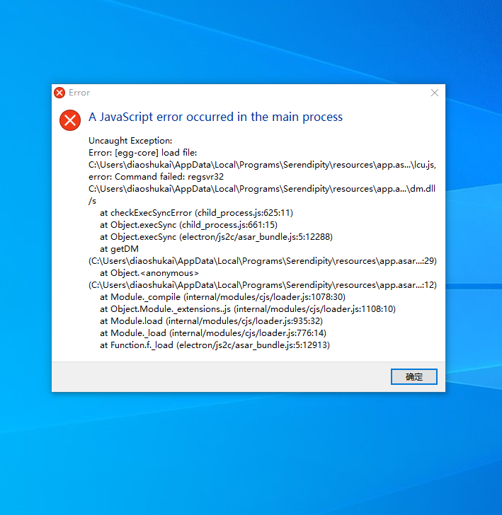

# 启动应用时报错误窗口

> dm.dll 适用于调用系统api的依赖模块，在当前程序中用于切换窗口，模拟键盘发送文本信息，截屏等功能，部分杀毒软件可能会报毒并删除该模块

:::tip 解决方法：
dm.dll位置在：${软件安装路径}\resources\app.asar.unpacked\node_modules\dm.dll\dist 下，检测dm.dll文件是否存在。 卸载软件 关杀毒或者安装路径加白名单  然后重新安装。 :::